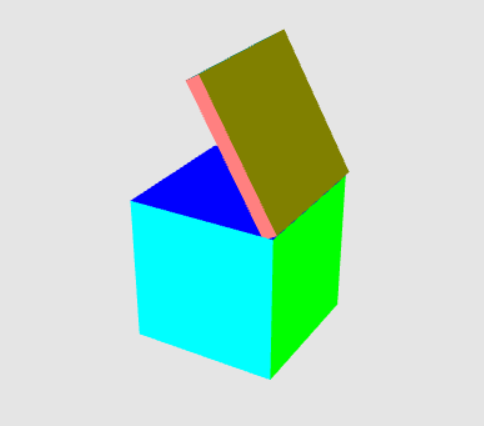

# ComputerGraphics_WebGL_GLSL
4th year 2nd semester Computer Graphics code using WebGL and GLSL control statement

<!--
*** Thanks for checking out the Best-README-Template. If you have a suggestion
*** that would make this better, please fork the repo and create a pull request
*** or simply open an issue with the tag "enhancement".
*** Thanks again! Now go create something AMAZING! :D
-->

<!-- ABOUT THE PROJECT -->
# About The Project

This Repository consist of 5 projects using WebGL and GLSL. These 5 projects are:
* Flower based on Rhodonea curve
* 2D goldfish using triangles
* 3D box that can rotate
* 3D box with lid
* Houses from outside with Lighting, Texture and Camera Movement
 

### Flower based on Rhodonea curve

This is a 2D flower based on the Rhodonea curve. Using GL_POINTS in the draw call. For each click, the arrangement of the petals will keep changing. Also, the color of the points will be alternated between green and red for each click. The sample outputs are shown in the images below. This pattern repeats for successive mouse clicks.   

<!-- -->

### 2D goldfish using triangles

t is a 2D scenario (model) of two goldfishes. The model was created using a 2D triangle mesh. Also, per-vertex color was applied to the model. Using the GLSL control statement keyboard interaction was Integrated inside the shader so that goldfishes can move forward but cannot go outside the screen. The sample outputs are shown in the images below.   

* Before Pressing  Space Key of Keboard

* After Pressing  Space Key of Keboard

### 3D box that can rotate

It is a 3D cube using index buffer. The color of a vertex is the absolute value of its coordinates, i.e., absolute values of X, Y and Z coordinates were treated as the R, G and B values respectively of its color attribute. In addition to that, a border was introduced for the object. For pressing LEFT and RIGHT arrow keys, the cube will rotate (+ve) along the Y and X-axis respectively. And for pressing the UP and DOWN arrow keys, the border will increase and decrease respectively. As shown by the images below.   

### 3D box with lid

It is a crate (box) with a lid. Both the crate and lid have the same coordinates. Only lid is the scaled (skewed) version of the crate. Two separate shader programs were used for the crate and the lid and perspective projection were applied to them. For each left and right arrow key pressing, the crate along with the lid (crate + lid)  rotates positive and negative degrees along Y-axis respectively. For each up and down arrow key pressing, only the lid opens and closes respectively. Output is shown in the images below.   

view output in youtube https://youtu.be/SQ4pp9qHakQ

### Houses from outside with Lighting, Texture and Camera Movement

It is a scenario where there are houses from outside. Houses mean one cottage with texture and one building with texture. Moreover, the Texture of the cottage changes on mouse click. Also, the Camera moves around the houses. Additionally, the Light position will rotate around the houses. The output is shown <a href="Houses_with_Lighting_CameraMovement_Texture/visualization.pdf">Here</a>.
For further visualization of output see this video https://youtu.be/oI0DA339u_U

To run this coe must download a web server such as Web server for chrome.

